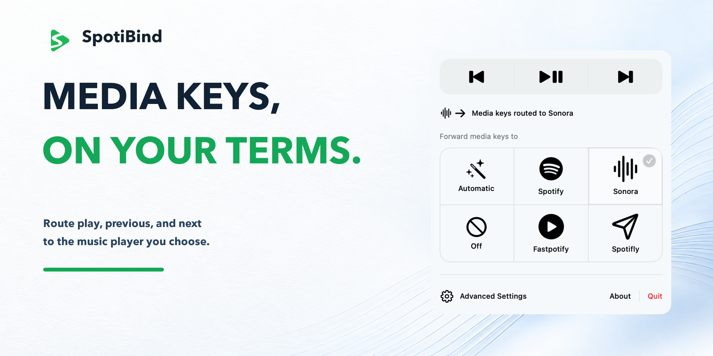

# SpotiBind

[](https://github.com/IvanLi-CN/spoti-bind/actions/workflows/pr.yml)
[](https://github.com/IvanLi-CN/spoti-bind/releases/latest)
[](LICENSE)
[](Package.swift)
[](Package.swift)

[简体中文](README.zh-CN.md)

<p align="center">
  <picture>
    <source media="(prefers-color-scheme: dark)" srcset="assets/social-previews/spotibind-social-preview-dark.png">
    
  </picture>
</p>

SpotiBind is a small macOS menu-bar utility that routes your hardware play/pause,
next, and previous keys to the desktop music player you choose. It keeps
playback ownership with the player and gives you one place to switch targets,
check readiness, and configure player locations.

## Features

- **Automatic routing** selects the first usable running player in Spotify,
  Fastpotify, Sonora, Spotifly order, then starts the first installed launchable
  player when none is running.
- **Explicit targets** let you pin forwarding to one supported player, or set
  forwarding to **Off** and leave macOS media-key behavior untouched.
- **Menu-bar controls** provide the current target, readiness state, and direct
  play/pause, next, and previous controls.
- **Player locations** support automatic discovery or a saved custom location for
  each player. Fastpotify accepts either its app bundle or executable.
- **Launch at login** is available from Advanced Settings.
- **Readiness-gated forwarding** consumes a media key only when the selected
  route is ready; otherwise the original event remains available to macOS.

## Requirements

- macOS 13.0 (Ventura) or later; the release DMG includes arm64 and x86_64
  binaries
- Accessibility permission for SpotiBind when forwarding is enabled
- At least one supported player for the mode you select
- Spotify Desktop for Spotify routing
- Fastpotify 0.4.1 or later for Fastpotify routing
- Sonora for Sonora routing
- Spotifly on macOS 26.2 or later for Spotifly routing

For development, use a Swift 6.0 toolchain (`swift-tools-version: 6.0`). A
complete Xcode developer toolchain is required for XCTest; Xcode 26.4 or later
is additionally required when packaging the native Icon Composer resources.

SpotiBind runs as the logged-in user. It does not require an administrator
password, root access, a System Extension, a privileged helper, or an Apple
Events/Automation permission. The distributed app is non-sandboxed and Ad Hoc
signed so it can use the public event-tap API and launch the separately
installed Fastpotify executable; Ad Hoc builds are not notarized.

## Install

1. Download the latest universal DMG from the
   [GitHub Releases page](https://github.com/IvanLi-CN/spoti-bind/releases/latest).
2. Open the DMG and move `SpotiBind.app` to `/Applications`.
3. If macOS shows a Gatekeeper warning, open the app from Finder with
   **Control-click, then Open**. The public Ad Hoc build is not notarized.
4. Before using a GUI player as a target, open that player once from Finder and
   approve its first-launch trust prompt. SpotiBind never bypasses this step.
5. Open the SpotiBind menu-bar item and choose **Automatic** or a specific
   player.
6. When macOS asks for access, open **System Settings > Privacy & Security >
   Accessibility**, enable SpotiBind, then return to the menu.

The first explicit active-mode selection or menu transport control can trigger
macOS's standard Accessibility prompt. Startup checks are silent. See
[docs/permissions.md](docs/permissions.md) for the permission and event-tap
boundaries.

The public artifact is built and verified by CI. Release readiness additionally
requires a pre-merge manual check for each advertised GUI player: after Finder
approval, close the player, cold-start SpotiBind, and verify that the first
media key is delivered exactly once. Record macOS version, architecture,
player version, and the result.

## Usage

1. Click the SpotiBind icon in the menu bar.
2. Choose **Automatic**, a supported player, or **Off**.
3. Press the hardware play/pause, next, or previous key. SpotiBind sends the
   matching command to the selected player.
4. Use **Advanced Settings** to choose player locations or enable launch at
   login.

One command is sent for each press. Repeated events during one hold and the
release event are consumed without sending another command. A command failure
is shown in the menu and is never replayed to another player. If a GUI player
cannot be trusted or launched on its first attempt, the status card explains
the neutral recovery reason and offers `Show in Finder` for the selected bundle.
After a launch callback failure, the local unified log records only the player
identifier, stage, error domain, and error code; it does not record paths,
accounts, or playback content.

### Supported players

| Player | Delivery surface | Play/pause | Next | Previous | Requirement |
| --- | --- | --- | --- | --- | --- |
| Spotify | PID-targeted keyboard shortcut | Space | Down Arrow | Up Arrow | Spotify Desktop |
| Fastpotify | `fastpotify` CLI | `fastpotify play-pause` | `fastpotify next` | `fastpotify previous` | Fastpotify 0.4.1+ |
| Sonora | PID-targeted keyboard shortcut | Space | Control-Right | Control-Left | Sonora |
| Spotifly | PID-targeted keyboard shortcut | Space | Command-Right | Command-Left | Spotifly; macOS 26.2+ |

Automatic mode prefers a usable running player in the table order. If no
supported player is running, it chooses the first installed player that can be
launched. A tray-resident Sonora process is treated as launchable: SpotiBind
reopens and activates Sonora's main window before delivering the command.

## Behavior and safety

- SpotiBind consumes a recognized media-key press only when forwarding is
  enabled, Accessibility is authorized, and a usable target is available. If
  any of those conditions is missing, the event passes through to macOS's normal
  media-key route.
- A physical press produces at most one player command. Release and repeat
  events do not create additional commands.
- A cold start is asynchronous and bounded by a ten-second launch window. A
  timed-out key is never replayed later.
- Fastpotify commands are serialized and have a two-second process timeout.
  Dispatch failures are shown in the menu and are not replayed to another
  player.
- If macOS disables the event tap, SpotiBind retries once. A second failure
  within the recovery window disables forwarding and sets the mode to **Off**.
- The event boundary accepts only the public `systemDefined` media-key event
  type. Ordinary keyboard and mouse events are returned unchanged.

For implementation-level details, see
[docs/architecture.md](docs/architecture.md) and
[docs/permissions.md](docs/permissions.md).

## Advanced Settings

Advanced Settings stores a path policy for Spotify, Fastpotify, Sonora, and
Spotifly:

- **Automatic** uses the app's supported discovery rules.
- **Custom** stores a user-selected application bundle and validates it before
  it becomes usable. Fastpotify may instead use a selected executable.
- **Reset** returns that player to Automatic discovery.

A missing or invalid custom path remains unavailable instead of silently
falling back to another location. The legacy Fastpotify `targetPath` preference
is read for compatibility until the user explicitly resets it.

## Troubleshooting

### The menu says Accessibility permission is required

Open **System Settings > Privacy & Security > Accessibility**, add SpotiBind if
necessary, and enable it. Return to SpotiBind and toggle the selected mode Off
and back on if the status has not refreshed yet. The app also rechecks its
readiness periodically.

### A selected player is unavailable

Open Advanced Settings and check the player location. A custom path must point
to the expected app bundle, except for Fastpotify, which may point to its
executable. For Fastpotify, SpotiBind also probes `now-playing --raw` before it
marks the route ready.

### Automatic chose a different player

Automatic is deterministic: it prefers running players in Spotify, Fastpotify,
Sonora, Spotifly order. Select a specific player when you need a fixed target.

### I want normal macOS media-key behavior again

Choose **Off** in the menu. SpotiBind removes its event tap and leaves the
system route available.

## Uninstall

Quit SpotiBind and remove `SpotiBind.app` from `/Applications`. Disable
**Launch at login** first if it is enabled. No separate helper or system
extension is installed.

## Build and test

SwiftPM is the entry point for the app, core package, and XCTest targets. The
checked-in Xcode project is used only to compile the native Icon Composer
resources during packaging.

From the repository root:

```sh
scripts/macos/test.sh
scripts/macos/build.sh --configuration release
scripts/macos/run.sh
```

To build and verify a universal release artifact:

```sh
scripts/macos/package.sh
scripts/macos/verify-release.sh
```

The package script builds arm64 and x86_64 macOS 13 binaries, assembles the
app, signs it Ad Hoc, creates a DMG, and writes `dist/SHA256SUMS`.

See [docs/testing.md](docs/testing.md) for the test layers and real-Mac
validation checklist, and [docs/release.md](docs/release.md) for the release
workflow.

## Contributing

Bug reports, compatibility notes, and pull requests are welcome. Before
opening a pull request:

- read [CONTRIBUTING.md](CONTRIBUTING.md);
- add or update Core XCTest coverage for routing and integration behavior;
- run the relevant local checks and include their results in the pull request;
- sign commits with `git commit --signoff`.

The architecture boundary and player adapter rules are documented in
[docs/architecture.md](docs/architecture.md). New delivery surfaces should
use a public, documented input contract and keep shell expansion and privileged
helpers out of the app.

## License

SpotiBind is released under the [MIT License](LICENSE).

SpotiBind is an independent project and is not affiliated with or endorsed by
Spotify, Fastpotify, Sonora, or Spotifly.
