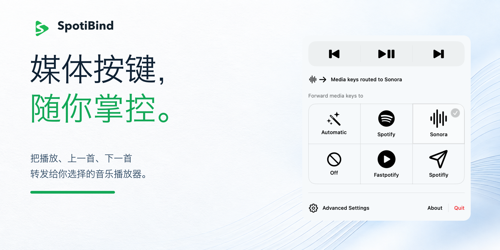

# SpotiBind

[](https://github.com/IvanLi-CN/spoti-bind/actions/workflows/pr.yml)
[](https://github.com/IvanLi-CN/spoti-bind/releases/latest)
[](LICENSE)
[](Package.swift)
[](Package.swift)

[English](README.md)

<p align="center">
  <picture>
    <source media="(prefers-color-scheme: dark)" srcset="assets/social-previews/spotibind-social-preview-dark-zh.png">
    
  </picture>
</p>

SpotiBind 是一款轻量的 macOS 菜单栏工具，可将硬件播放/暂停、下一首和上一首按键路由到你选择的桌面音乐播放器。播放控制仍由播放器负责，SpotiBind 负责统一切换目标、显示就绪状态和配置播放器位置。

## 社区

欢迎在 [https://linux.do](https://linux.do) 讨论 SpotiBind。

## 功能

- **自动路由**：按 Spotify、Fastpotify、Sonora、Spotifly 的顺序选择当前可用的运行中播放器；如果都未运行，则启动第一个已安装且可启动的播放器。
- **固定目标**：将转发固定到某个支持的播放器，也可以选择 **关闭**，完全交还 macOS 的媒体按键逻辑。
- **菜单栏控制**：显示当前目标和就绪状态，并提供播放/暂停、下一首、上一首控制。
- **播放器位置**：每个播放器都支持自动发现或保存自定义位置；Fastpotify 可以选择应用包或可执行文件。
- **登录时启动**：可在高级设置中开启。
- **就绪后才转发**：只有目标和权限都准备就绪时才会消费媒体按键，否则原始事件继续交给 macOS。

## 系统要求

- macOS 13.0（Ventura）或更高版本；发布 DMG 同时包含 arm64 和 x86_64
  二进制文件
- 开启转发时，需要为 SpotiBind 授予辅助功能权限
- 你选择的模式至少需要一个对应的支持播放器
- Spotify 路由需要 Spotify Desktop
- Fastpotify 路由需要 Fastpotify 0.4.1 或更高版本
- Sonora 路由需要 Sonora
- Spotifly 路由需要 macOS 26.2 或更高版本

开发环境需要 Swift 6.0 工具链（`swift-tools-version: 6.0`）。运行 XCTest
需要完整的 Xcode 开发者工具链；打包原生 Icon Composer 资源还需要 Xcode
26.4 或更高版本。

SpotiBind 以当前登录用户运行，不需要管理员密码、root 权限、系统扩展、特权辅助进程或 Apple Events/自动化权限。公开发布的应用未启用 App Sandbox，并使用 Ad Hoc 签名，以便使用公开的事件 Tap API 和启动单独安装的 Fastpotify 可执行文件；Ad Hoc 构建不会经过公证。

## 安装

1. 从 [GitHub Releases](https://github.com/IvanLi-CN/spoti-bind/releases/latest) 下载最新的 Universal DMG。
2. 打开 DMG，将 `SpotiBind.app` 拖到 `/Applications`。
3. 如果 macOS 显示 Gatekeeper 警告，请在 Finder 中按住 Control 点击应用，选择 **打开**。公开的 Ad Hoc 构建未经过公证。
4. 将 GUI 播放器作为目标前，先在 Finder 中打开它一次并批准首次启动的信任提示。SpotiBind 不会绕过这一步。
5. 打开菜单栏中的 SpotiBind，选择 **自动** 或某个具体播放器。
6. macOS 请求权限时，前往 **系统设置 → 隐私与安全性 → 辅助功能**，启用 SpotiBind，然后返回菜单栏。

### Homebrew

可以从当前仓库的第三方 tap 安装同一个发布版本：

```sh
brew tap IvanLi-CN/spoti-bind https://github.com/IvanLi-CN/spoti-bind.git
brew install --cask IvanLi-CN/spoti-bind/spotibind
```

升级或卸载 cask：

```sh
brew upgrade --cask IvanLi-CN/spoti-bind/spotibind
brew uninstall --cask spotibind
```

该 cask 安装的仍是同一个 Ad Hoc、未经过公证的应用。如果 macOS 阻止首次启动，请在 Finder 中按住 Control 点击 `SpotiBind.app`，选择 **打开**。媒体按键转发仍需要完成上面的辅助功能授权步骤。公开 Release 会先保持 Draft，直到同仓库 Cask 已同步，并且其版本、下载 URL 和 checksum 已针对同一份 DMG 完成校验。

第一次明确选择启用的转发模式，或点击菜单中的媒体控制按钮时，可能会触发 macOS 的标准辅助功能权限提示。应用启动时只进行静默检查。权限和事件 Tap 的边界说明见 [docs/permissions.md](docs/permissions.md)（英文）。

公开构建由 CI 构建并验证。发布就绪前还需要对每个已宣传支持的 GUI 播放器进行手动检查：完成 Finder 首次启动授权后，关闭播放器，冷启动 SpotiBind，并确认第一枚媒体按键只投递一次。请记录 macOS 版本、架构、播放器版本和结果。

## 使用方法

1. 点击菜单栏中的 SpotiBind 图标。
2. 选择 **自动**、某个支持的播放器，或 **关闭**。
3. 按下键盘上的播放/暂停、下一首或上一首按键，SpotiBind 会向选中的播放器发送对应指令。
4. 打开 **高级设置**，配置播放器位置或开启登录时启动。

### 支持的播放器

| 播放器 | 交付方式 | 播放/暂停 | 下一首 | 上一首 | 要求 |
| --- | --- | --- | --- | --- | --- |
| [Spotify](https://www.spotify.com/) | 按 PID 定向发送键盘快捷键 | Space | Down Arrow | Up Arrow | Spotify Desktop |
| [Fastpotify](https://github.com/crmne/spotifast) | `fastpotify` CLI | `fastpotify play-pause` | `fastpotify next` | `fastpotify previous` | Fastpotify 0.4.1+ |
| [Sonora](https://github.com/Nurik-dz/Sonora) | 按 PID 定向发送键盘快捷键 | Space | Control-Right | Control-Left | Sonora |
| [Spotifly](https://github.com/ralph/Spotifly) | 按 PID 定向发送键盘快捷键 | Space | Command-Right | Command-Left | Spotifly；macOS 26.2+ |

自动模式会优先选择表格顺序中可用的运行中播放器。如果没有支持的播放器正在运行，则选择第一个已安装且可启动的播放器。Sonora 仅驻留菜单栏时也会被视为可启动目标；SpotiBind 会先重新打开并激活 Sonora 的主窗口，再发送指令。

## 行为与安全边界

- 只有在启用转发、辅助功能权限有效且存在可用目标时，SpotiBind 才会消费识别到的媒体按键按下事件。任一条件不满足时，事件都会继续走 macOS 的正常媒体按键路径。
- 一次物理按键最多产生一条播放器指令，释放和重复事件不会造成额外指令。
- 冷启动采用异步且有上限的十秒启动窗口；超时的按键不会在之后重放。
- Fastpotify 指令会串行执行，并有两秒进程超时。发送失败会显示在菜单中，也不会改发给其他播放器。
- 如果 GUI 播放器首次启动时未获信任或启动失败，状态卡会显示中性的恢复原因，并为选中的应用包提供“在 Finder 中显示”。启动回调失败时，本地统一日志只记录播放器标识、阶段、错误域和错误代码，不记录路径、账户或播放内容。
- 如果 macOS 禁用了事件 Tap，SpotiBind 会立即移除它，但保留已选择的模式；只有辅助功能权限被撤销后重新授予，才会恢复转发。
- 事件边界只接受公开的 `systemDefined` 媒体按键事件，普通键盘和鼠标事件会原样返回。

实现级说明见 [docs/architecture.md](docs/architecture.md) 和 [docs/permissions.md](docs/permissions.md)（英文）。

## 高级设置

高级设置会为 Spotify、Fastpotify、Sonora 和 Spotifly 保存位置策略：

- **自动**：使用应用支持的自动发现规则。
- **自定义**：保存用户选择的应用包，并在使用前验证；Fastpotify 也可以选择可执行文件。
- **重置**：将该播放器恢复为自动发现。

自定义路径缺失或无效时会保持不可用，不会悄悄回退到其他位置。为了兼容旧版本，Fastpotify 的 `targetPath` 偏好设置会继续读取，直到用户明确执行重置。

## 常见问题

### 菜单提示需要辅助功能权限

打开 **系统设置 → 隐私与安全性 → 辅助功能**，必要时先添加 SpotiBind，再启用它。返回 SpotiBind 后，应用会在一秒内重新检查就绪状态。若菜单显示“媒体键捕获已暂停”，请先撤销 SpotiBind 的辅助功能权限，再重新授予；无需切换已选择的模式。

### 选中的播放器不可用

打开高级设置检查播放器位置。自定义路径必须指向对应的应用包；Fastpotify 也可以指向其可执行文件。对于 Fastpotify，SpotiBind 还会先探测 `now-playing --raw`，成功后才将路由标记为就绪。

### 自动模式选择了其他播放器

自动模式的选择顺序固定为 Spotify、Fastpotify、Sonora、Spotifly，并优先选择正在运行的播放器。需要固定目标时，请直接选择具体播放器。

### 我想恢复 macOS 的正常媒体按键行为

在菜单中选择 **关闭**。SpotiBind 会移除事件 Tap，并将媒体按键交还给系统。

## 卸载

退出 SpotiBind，然后从 `/Applications` 删除 `SpotiBind.app`。如果开启了 **登录时启动**，请先关闭该选项。应用不会安装额外的辅助进程或系统扩展。

## 构建与测试

应用、核心包和 XCTest 目标都以 SwiftPM 为入口。仓库中的 Xcode 工程只在打包时用于编译原生 Icon Composer 资源。

在仓库根目录执行：

```sh
scripts/macos/test.sh
scripts/macos/build.sh --configuration release
scripts/macos/run.sh
```

构建并验证 Universal 发布产物：

```sh
scripts/macos/package.sh
scripts/macos/verify-release.sh
```

打包脚本会构建 arm64 和 x86_64 的 macOS 13 二进制文件，组装应用、进行 Ad Hoc 签名、创建 DMG，并写入 `dist/SHA256SUMS`。

测试分层和实机验证清单见 [docs/testing.md](docs/testing.md)，发布流程见 [docs/release.md](docs/release.md)（均为英文）。

## 参与贡献

欢迎提交问题、兼容性反馈和 Pull Request。提交前请：

- 阅读 [CONTRIBUTING.md](CONTRIBUTING.md)；
- 为路由和集成行为补充或更新 Core XCTest 覆盖；
- 运行相关本地检查，并在 Pull Request 中记录结果；
- 使用 `git commit --signoff` 签署提交。

架构边界和播放器适配规则见 [docs/architecture.md](docs/architecture.md)（英文）。新的交付方式应使用公开且有文档的输入契约，避免在应用中引入 shell 展开或特权辅助进程。

## 灵感来源

SpotiBind 的灵感来自 [macmediakeyforwarder](https://github.com/milgra/macmediakeyforwarder)。

## 许可证

SpotiBind 使用 [MIT License](LICENSE) 开源。

SpotiBind 是独立项目，与 Spotify、Fastpotify、Sonora 或 Spotifly 没有隶属、赞助或认可关系。
